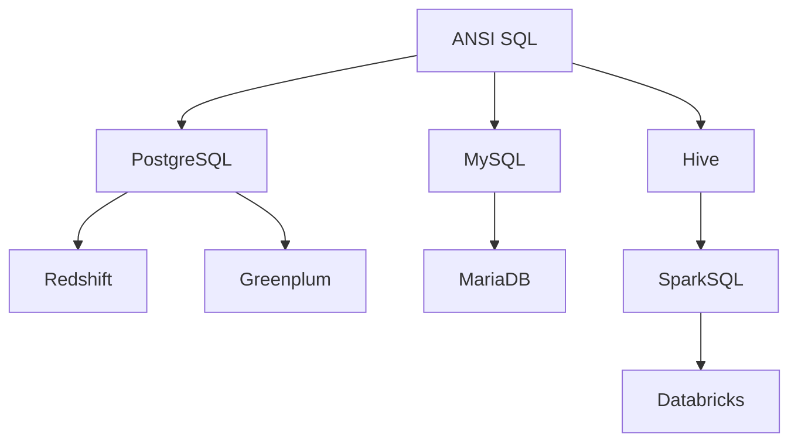

A **dialect** in SQLFluff is a complete definition of how a particular flavour of SQL should be parsed and linted. Because SQL has no single authoritative standard — every database platform extends or modifies the language in its own way — SQLFluff uses dialects to model those differences accurately.

SQLFluff currently supports [28 SQL dialects](/dialects/supported), from ANSI SQL through to Snowflake, BigQuery, T-SQL, and more.

## What a dialect controls

A dialect defines:

- **Grammar** — which SQL statements, clauses, and expressions are valid, and how they are structured into a parse tree.
- **Keywords** — reserved words, identifiers, quoting rules, and case sensitivity behaviour.
- **Rule overrides** — dialect-specific rule behaviour, for example whether `SELECT *` is permitted or how aliases must be written.

## Setting the dialect

SQLFluff needs to know which dialect to use before it can parse a file. If no dialect is specified, it defaults to `ansi`.

<Tabs>
  <Tab title="CLI flag">
    Pass `--dialect` to any SQLFluff command:

    ```bash
    sqlfluff lint query.sql --dialect snowflake
    sqlfluff fix query.sql --dialect bigquery
    sqlfluff parse query.sql --dialect tsql
    ```
  </Tab>
  <Tab title="Config file">
    Set the dialect in your `.sqlfluff` configuration file so you do not have to repeat it on every command:

    ```ini .sqlfluff
    [sqlfluff]
    dialect = snowflake
    ```

    SQLFluff searches for `.sqlfluff` starting from the directory of the file being linted and walking up to the filesystem root. Place the file at the root of your repository to apply it to all SQL in the project.
  </Tab>
  <Tab title="Environment variable">
    Set `SQLFLUFF_DIALECT` in the environment:

    ```bash
    export SQLFLUFF_DIALECT=postgres
    sqlfluff lint .
    ```
  </Tab>
</Tabs>

<Tip>
  Run `sqlfluff dialects` to print the list of dialect names available in your installed version of SQLFluff.
</Tip>

## Dialect inheritance

All dialects inherit from the root `ansi` dialect. When a dialect only needs to modify a small part of the grammar, it extends its parent and overrides only the relevant segments. This keeps dialect definitions concise and avoids duplicating shared grammar.

For example, `redshift` inherits from `postgres` because Redshift's SQL is closely based on PostgreSQL. This does not mean the two are fully compatible — it means that when the Redshift dialect was written, PostgreSQL was the closest starting point.



<Note>
  Inheritance in SQLFluff is a code-reuse mechanism, not a statement about SQL compatibility. A dialect inheriting from another does not imply that SQL valid in the parent will always be valid in the child.
</Note>

When you contribute grammar changes to a dialect, consider:

- **Should this change go into a parent dialect?** If the syntax is shared with the parent (e.g. a PostgreSQL feature that Redshift also supports), adding it to the parent benefits all child dialects.
- **Will this change affect child dialects?** Adding or modifying grammar in a parent dialect may break downstream dialects that do not expect the new syntax.

## The dialect ecosystem

SQLFluff dialects are maintained by the community. Most dialects do not implement 100% of a platform's SQL surface area — they cover the most common patterns and grow over time as contributors add missing syntax.

If you encounter a parse error on valid SQL, the dialect may simply not support that syntax yet. The best way to add it is to:

1. Open an issue on [GitHub](https://github.com/sqlfluff/sqlfluff/issues) describing the unsupported syntax.
2. Submit a pull request with a grammar fix and a test fixture. See the [dialect development guide](https://docs.sqlfluff.com/en/stable/guides/dialect_development.html) for instructions.

## Next steps

<CardGroup cols={2}>
  <Card title="Supported dialects" icon="database" href="/dialects/supported">
    Full list of all supported dialects and their CLI flag values.
  </Card>
  <Card title="Configuration" icon="gear" href="/configuration/overview">
    Set the dialect and other options via config file, environment variable, or CLI.
  </Card>
</CardGroup>
